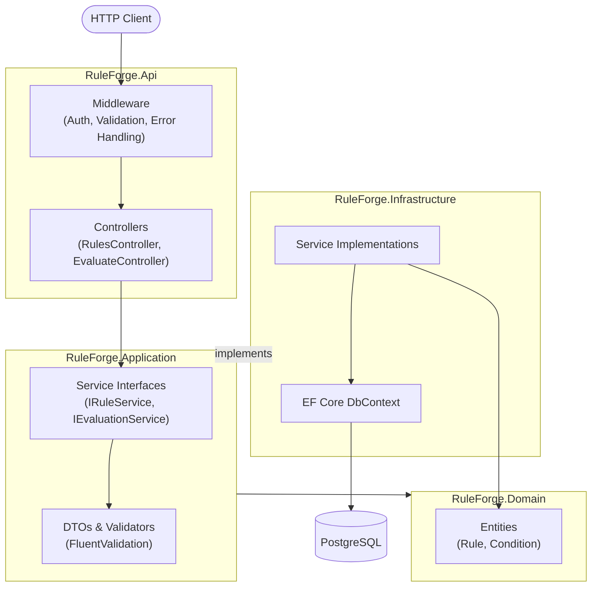

# RuleForge

[](https://github.com/muratcant/RuleForge/actions/workflows/ci.yml)
[](https://codecov.io/gh/muratcant/RuleForge)
[](https://dotnet.microsoft.com/en-us/download/dotnet/8.0)

A REST API for defining and evaluating business rules at runtime — no redeployment needed. Rules are composed of prioritized conditions that evaluate arbitrary JSON payloads against configurable operators.

---

## Overview

RuleForge lets you manage a library of named rules, each containing one or more conditions. When you submit a JSON document to the evaluation endpoint, the engine runs all active rules in priority order and returns which rules matched.

Use cases include feature flags, access control policies, fraud detection triggers, or any domain where business logic needs to change frequently without touching code.

---

## Architecture

RuleForge follows Clean Architecture with a strict dependency rule — inner layers know nothing about outer ones.



- The **API** layer receives HTTP requests, validates input via FluentValidation, and delegates to Application services.
- The **Application** layer defines interfaces (e.g. `IRuleService`, `IEvaluationService`) and orchestrates domain operations.
- The **Infrastructure** layer implements those interfaces using EF Core and PostgreSQL.
- The **Domain** layer holds pure business entities and has no external dependencies.

---

## Tech Stack

| Concern | Technology |
|---|---|
| Framework | .NET 8 / ASP.NET Core |
| Database | PostgreSQL 16 |
| ORM | Entity Framework Core 8 |
| Validation | FluentValidation |
| Authentication | JWT Bearer |
| Logging | Serilog (console + file sinks) |
| API Docs | Swagger / OpenAPI |
| Containerization | Docker + Docker Compose |
| Testing | xUnit, FluentAssertions, NSubstitute |
| Integration Tests | Testcontainers (real PostgreSQL) |
| Coverage | coverlet + Codecov |

---

## Getting Started

### Prerequisites

- [Docker](https://docs.docker.com/get-docker/) and Docker Compose

### 1. Configure environment variables

```bash
cp .env.example .env
```

Open `.env` and set your own values:

```env
POSTGRES_PASSWORD=your_secure_password
PGADMIN_DEFAULT_EMAIL=admin@example.com
PGADMIN_DEFAULT_PASSWORD=your_secure_password
```

### 2. Start the stack

```bash
docker compose up
```

This will:

1. Start a PostgreSQL 16 container
2. Run EF Core migrations automatically
3. Start the API on **http://localhost:5001**

Swagger UI is available at **http://localhost:5001/swagger** when running in Development mode.

pgAdmin (development only) is available at **http://localhost:5050**.

---

## API Endpoints

All endpoints require a valid JWT. Role requirements are noted per group.

### Rules — `[Authorize(Roles = "Admin")]`

| Method | Path | Description |
|--------|------|-------------|
| `GET` | `/api/rules` | List rules (paginated). Query params: `page`, `pageSize`, `name` |
| `GET` | `/api/rules/{id}` | Get a single rule by ID |
| `POST` | `/api/rules` | Create a new rule |
| `PUT` | `/api/rules/{id}` | Update an existing rule |
| `DELETE` | `/api/rules/{id}` | Delete a rule |

### Evaluate — `[Authorize(Roles = "User")]`

| Method | Path | Description |
|--------|------|-------------|
| `POST` | `/api/evaluate` | Evaluate a JSON payload against all active rules |

#### Example: Create a rule

```http
POST /api/rules
Content-Type: application/json
Authorization: Bearer <token>

{
  "name": "High-value order",
  "priority": 10,
  "conditions": [
    { "field": "order.total", "operator": "GreaterThan", "value": "1000" }
  ]
}
```

#### Example: Evaluate a payload

```http
POST /api/evaluate
Content-Type: application/json
Authorization: Bearer <token>

{
  "order": {
    "total": 1500,
    "currency": "USD"
  }
}
```

---

## Running Tests

The test suite includes unit tests and integration tests. Integration tests use [Testcontainers](https://dotnet.testcontainers.org/) to spin up a real PostgreSQL instance, so Docker must be running.

```bash
dotnet test RuleForge.sln
```

To collect code coverage locally:

```bash
dotnet test RuleForge.sln \
  --collect:"XPlat Code Coverage" \
  --results-directory ./coverage
```

Coverage reports are uploaded to [Codecov](https://codecov.io/gh/muratcant/RuleForge) on every push to `master` via the CI pipeline.

---

## Project Structure

```
RuleForge/
├── RuleForge.Api/                  # ASP.NET Core Web API
│   ├── Controllers/                # RulesController, EvaluateController
│   └── Program.cs                  # Service registration and middleware pipeline
│
├── RuleForge.Application/          # Use cases and interfaces
│   ├── Common/                     # Shared types (e.g. PagedResult)
│   ├── Rules/                      # IRuleService, DTOs, FluentValidation validators
│   └── Evaluate/                   # IEvaluationService, evaluation DTOs
│
├── RuleForge.Domain/               # Core business entities
│   └── Rules/                      # Rule and Condition entities
│
├── RuleForge.Infrastructure/       # External concerns
│   ├── Persistence/                # EF Core DbContext, configurations, migrations
│   ├── Rules/                      # RuleService implementation
│   └── Evaluate/                   # EvaluationService implementation
│
├── RuleForge.Tests/                # Test suite
│   ├── Integration/                # Testcontainers-based API + service tests
│   ├── Services/                   # Unit tests for service layer
│   ├── Evaluate/                   # Evaluation engine tests
│   └── Validation/                 # FluentValidation rule tests
│
├── docker-compose.yml              # Production-oriented service definitions
├── docker-compose.override.yml     # Development extras (pgAdmin, port mappings)
└── Dockerfile                      # Multi-stage: build → migrate → runtime
```

---

## CI / CD

The GitHub Actions pipeline (`.github/workflows/ci.yml`) runs on every push and pull request to `master`:

1. **Restore** — `dotnet restore`
2. **Build** — `dotnet build --configuration Release`
3. **Test** — `dotnet test` with XPlat Code Coverage collection
4. **Coverage upload** — results are sent to Codecov via `codecov/codecov-action`

The pipeline fails fast: any build error or test failure stops execution immediately.

To enable Codecov, add your `CODECOV_TOKEN` to the repository's **Settings → Secrets → Actions**.
